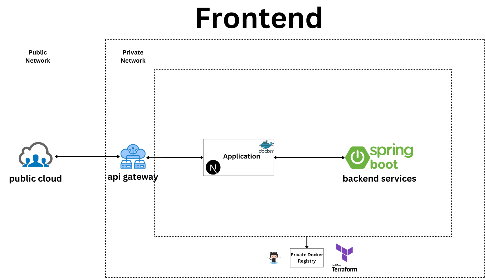

  

# Next.js 13 Frontend with Monolithic Architecture on Google Cloud Platform (GCP)

## Introduction

This documentation provides an overview of the frontend architecture for the application built using Next.js version 13. The frontend follows a monolithic architectural pattern and is deployed on Google Cloud Platform (GCP). Docker is used for containerization, and Kubernetes is employed for vertical scaling.

## Table of Contents

1. **Architecture Overview**
    - 1.1. Technology Stack
    - 1.2. Monolithic Architecture
2. **Cloud Infrastructure**
    - 2.1. Google Cloud Platform (GCP) Deployment
    - 2.2. Kubernetes for Vertical Scaling
3. **Containerization**
    - 3.1. Docker Setup
    - 3.2. Containerized Deployment
4. **Deployment**
    - 4.1. Google Cloud Platform (GCP) Deployment
5. **Scalability**
    - 5.1. Kubernetes for Vertical Scaling

## 1. Architecture Overview

### 1.1. Technology Stack

The frontend is built using the following technologies:

- Next.js 13: A popular framework for building server-side rendered (SSR) React applications.
- Google Cloud Platform (GCP): Used for hosting and managing various services.
- Docker: Used for containerizing the frontend application.
- Kubernetes: Ensures efficient vertical scaling of the application.

### 1.2. Monolithic Architecture

The frontend follows a monolithic architecture, where the entire application is built as a single, cohesive unit. In this approach, all features and functionalities are tightly integrated, simplifying development and deployment. However, it may have limitations in terms of scalability and maintainability as the application grows.

## 2. Cloud Infrastructure

### 2.1. Google Cloud Platform (GCP) Deployment

The frontend application is deployed on Google Cloud Platform (GCP), which provides a secure and scalable infrastructure for hosting web applications. GCP offers various services such as Compute Engine, App Engine, and Cloud Storage, which can be leveraged to ensure high availability and performance.

### 2.2. Kubernetes for Vertical Scaling

To manage and scale the frontend application effectively, Kubernetes is employed. Kubernetes allows vertical scaling by adjusting the resources allocated to the application based on demand. This ensures that the frontend can handle increased traffic and load without compromising performance.

## 3. Containerization

### 3.1. Docker Setup

Docker is used to containerize the Next.js 13 frontend application. Containerization ensures that the application and its dependencies are packaged together, providing consistency across different environments.

### 3.2. Containerized Deployment

With Docker, the frontend application can be easily deployed as containers. These containers can be managed, scaled, and orchestrated using Kubernetes, providing a flexible and efficient deployment process.

## 4. Deployment

### 4.1. Google Cloud Platform (GCP) Deployment

The containerized frontend application is deployed on Google Cloud Platform (GCP). GCP's App Engine or Compute Engine can be utilized to run the containers in a managed and scalable environment.

## 5. Scalability

### 5.1. Kubernetes for Vertical Scaling

Kubernetes ensures vertical scalability by automatically adjusting the allocated resources for the frontend application based on utilization metrics. This allows the frontend to handle increased traffic and user demands efficiently.

---

This concludes the documentation for the frontend architecture of the application. It covers the technology stack, monolithic architectural pattern, deployment on Google Cloud Platform (GCP) with Kubernetes for vertical scaling, and containerization using Docker. The monolithic architecture provides simplicity during development, while Kubernetes ensures efficient scaling and resource management for the frontend application.
