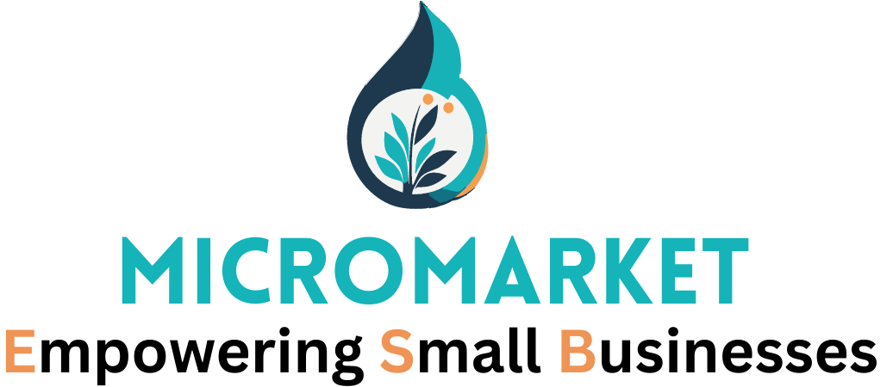

  

# MicroMarket: Revolutionizing Small Business Online Presence

MicroMarket is a game-changing web marketplace designed to empower small businesses in showcasing and hosting their products online. Our platform offers a highly accessible and feature-rich solution, powered by the cutting-edge technologies of Spring Boot with a Microservices architecture for the backend, and Next.js for the frontend.

## Key Points

- Traditional marketplaces often limit businesses to showcasing products only, but MicroMarket goes beyond that by providing a full-fledged marketplace experience.
- Small businesses no longer need to create individual websites; MicroMarket eliminates the need for complex website development.
- With MicroMarket, entrepreneurs can effortlessly showcase and manage their products, reaching a wider audience and expanding their brand presence.

## Benefits

- Comprehensive solution for small business online presence.
- Enhanced customer engagement through advanced marketplace functionality.
- Streamlined product management and customization options.
- Integrated marketing tools for increased brand visibility.

## Cutting-Edge Technology

- **Backend**: Our backend is built using Spring Boot, a powerful and flexible framework that provides a robust foundation for microservices architecture. This enables seamless scalability, fault tolerance, and efficient handling of business logic.
- **Frontend**: The frontend is crafted using Next.js, a popular React framework that offers server-side rendering, enhanced performance, and a delightful user experience. With Next.js, we ensure a responsive and dynamic interface for your customers.

## Join MicroMarket Today!

Embrace MicroMarket and embark on a journey of growth and success! Our platform empowers small businesses to thrive in the digital landscape. Say goodbye to limitations and unleash your full potential with MicroMarket.

[Include MicroMarket logo or visual element here for added impact]
